# Jellyberry Kanban orchestration design — V2: Hermes setup and memory banks

> **Status:** Expanded decision candidate for operator review  
> **Based on:** V1 plus live Jellyberry TUI, profile, Desktop Project, Kanban, Hindsight, and cron inspection  
> **Live snapshot checked:** 2026-08-08 02:36 BST  
> **Implementation state:** Proposed; this document does not authorize profile, bank, board, dispatcher, repository, deployment, or privilege changes. V1 remains preserved separately.

## What V2 adds

- Direct evidence from the active Jellyberry TUI session.
- The current Hermes profile, Desktop Project, board, and dispatcher state.
- The applied Hindsight bank-routing decision and live bank inventory.
- Explicit board → repository → profile → skill → bank routing.
- Project-bound LogK implementation and review profiles for the first pilot.
- Bank-maintenance, retention, and source-priority rules.
- Newly observed stale Desktop Project paths alongside the previously identified stale board paths.

## Executive decision

Adopt a **Kanban-centred, repository-backed development system** with these boundaries:

1. Jellyberry is the single orchestration control plane.
2. Hermes Kanban owns live execution state, dependencies, assignees, attempts, blocked reasons, and handoffs.
3. Git repositories own specifications, ticket definitions, decisions, implementation, tests, and durable review evidence.
4. Central Hindsight on Jellyhome provides scoped durable memory through explicit global, role, and project banks.
5. Every persistent orchestrated project has an explicit memory route; opening a Desktop Project does not switch banks automatically.
6. A Kanban assignee is always a real Hermes profile on Jellyberry, and that profile's configured memory bank is part of its execution identity.
7. Matt Pocock skills define **how** an assigned profile performs a development phase.
8. Remote Hermes, OpenCode, Claude Code, or other execution engines sit behind a Jellyberry Hermes profile or reviewed adapter.
9. Repository documents and current live state remain authoritative over recalled memory when they disagree.
10. Start with manual decomposition and one executable card at a time. Add dynamic bank routing and automatic orchestration only after the complete profile/skill/bank path is repeatable.

The governing rule is:

> **The board owns the task. A worker owns one execution attempt. Git and repository documents preserve the durable result. Hindsight preserves only scoped, reusable knowledge.**

---

## 1. System architecture

### 1.1 Control plane and execution plane

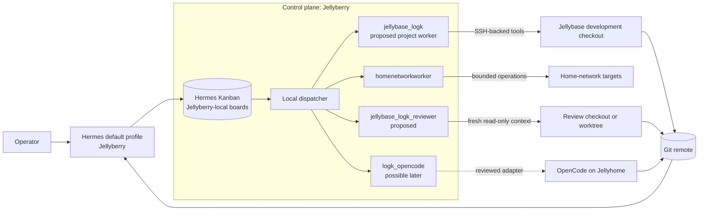

The dispatcher, board database, card claims, heartbeats, logs, and worker processes remain local to Jellyberry. A worker profile may execute tools through SSH, but remote hosts do not become members of one shared SQLite board.

### 1.2 Compact mental model

```text
Operator
  │
  ▼
Hermes default profile
  │ creates/approves cards
  ▼
Jellyberry Kanban board
  │ dispatches a real local profile
  ▼
Hermes worker profile
  │ may execute locally, over SSH, or through an adapter
  ▼
Git branch/worktree + repository evidence
  │
  ▼
Independent review and operator decision
```

---

## 1A. Hermes setup and Hindsight memory fabric

This V2 section integrates the decisions from the live Jellyberry TUI session and the applied memory-routing documents. It separates Hermes interfaces, profiles, Projects, sessions, Kanban, repositories, hosts, and Hindsight banks rather than treating them as one agent concept.

### 1A.1 Live TUI session considered

The active Jellyberry TUI was inspected directly in `tmux:0.0` rather than inferred from old notes.

Observed state:

- It is a `default`-profile Hermes CLI process resumed with `hermes --continue`.
- Session title: `Hindsight Plugin Test Results #2`.
- The session is currently using `gpt-5.5` through OpenAI Codex.
- Its latest work upgraded and verified Hindsight `0.9.0`, corrected profile-to-bank wiring, introduced read-only maintenance checks, and raised the fresh-session prefetch visibility timeout to 30 seconds.
- The session has been compressed several times. Its durable decisions were cross-checked against live configuration, the Hindsight API, and repository documents rather than copied blindly from TUI scrollback.

The relevant recorded decisions are in:

- `docs/reports/hindsight-bank-routing-2026-08-08.md` — applied routing decision and live bank inventory.
- `docs/runbooks/memory-hygiene-runbook.md` — current operating policy.
- `docs/reports/hindsight-bank-taxonomy-proposal.md` — earlier proposal; useful history, but superseded where the applied update differs.
- `docs/operations/hermes-desktop-projects-profiles-and-sessions.md` — Hermes setup and conceptual boundaries.

### 1A.2 Complete Hermes stack

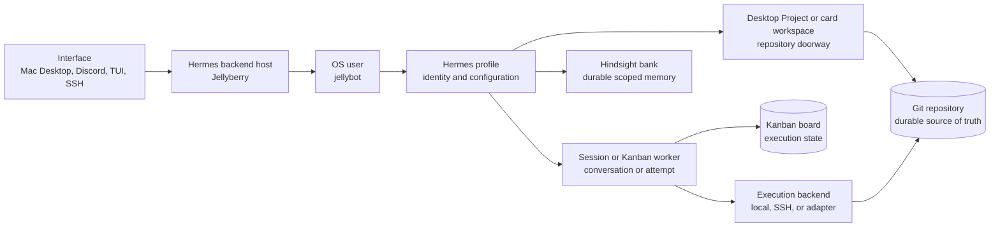

Use this rule throughout:

```text
Interface ≠ host ≠ OS user ≠ profile ≠ Desktop Project
          ≠ repository ≠ session ≠ worker ≠ board ≠ bank ≠ model
```

A Mac Desktop Project can point to a Jellyberry path. A Jellybase-backed profile executes against a separate Jellybase path. A Hindsight bank is neither path and is not selected merely because a Project is open.

### 1A.3 Current profile-to-bank wiring

Live profile memory checks report Hindsight installed and available for all three current profiles.

```text
Profile                Execution role                     Hindsight bank
─────────────────────  ─────────────────────────────────  ─────────────────────
default                operator/general coordinator       hermes-main
homenetworkworker      home-network specialist            home-network-main
jellybase_hermes       generic Jellybase worker over SSH  jellybase-worker-main
```

#### `default` → `hermes-main`

- `auto_recall: true`
- `auto_retain: true`
- `retain_async: true`
- Fresh-session prefetch visibility timeout: 30 seconds.
- Holds cross-cutting Hermes operating memory, profile/tool conventions, Desktop/session/Kanban policy, and memory policy.
- It should not become the automatic destination for detailed project architecture merely because the operator opened a project.

#### `homenetworkworker` → `home-network-main`

- `auto_recall: true`
- `auto_retain: true`
- Holds durable home-network topology, monitoring, backup/restore, deployment, and operational knowledge.
- Repository and current infrastructure state remain authoritative before side effects.

#### `jellybase_hermes` → `jellybase-worker-main`

- `auto_recall: true`
- `auto_retain: false`
- Holds reusable worker facts such as SSH behavior, no-sudo constraints, checkout conventions, and test/build environment lessons.
- It must not automatically retain LogK, portfolio, or other project architecture into the generic worker bank.
- Project context reaches it through the card, repository documents, and explicit checkout/branch references.

### 1A.4 Central bank topology

Hindsight remains centralized on Jellyhome:

```text
API:     http://jellyhome:18888
UI:      http://192.168.1.1:9999
Version: 0.9.0
```

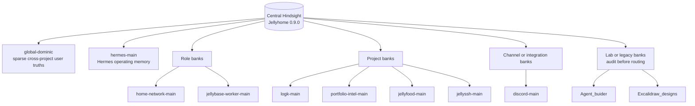

Banks observed live but not assigned a role by this design, including `Agent_buider` and `Excalidraw_designs`, must be audited before use. Their presence is not evidence that a current Project or profile routes to them.

### 1A.5 What “each project has a bank” means

The recorded decision is **not** “create a bank automatically for every Desktop Project or session.” The applied rule is:

> Use one central Hindsight service with a sparse shared bank, stable role banks, and project-specific banks for durable projects whose domain boundary and recall needs justify them.

For orchestration, strengthen this into an explicit contract:

> Every persistent project must declare a memory route, even when the route is “shared bank” or “no automatic retention.”

Current and proposed mapping:

```text
Project/workstream               Board                            Memory route
───────────────────────────────  ───────────────────────────────  ─────────────────────────────────────
Hermes operations                continuous-hermes-improvement    hermes-main
Home network                     home-network                     home-network-main
LogK                             logk (planned)                    logk-main
Portfolio intelligence           portfolio                        portfolio-intel-main
Jellybase transport validation   spawner                          jellybase-worker-main
3D Print Loader                  3dprint-loader                    not yet explicitly assigned
Diagram Creator                  Desktop Project; no board here   not yet verified/assigned
```

The unassigned rows are deliberate gaps. Do not silently infer that `Excalidraw_designs` is the Diagram Creator bank or that `home-network-main` is the 3D Print Loader project bank without an explicit decision and recall test.

A dedicated project bank is justified when:

1. The domain boundary is stable.
2. The project produces durable reusable architecture, decisions, or recurring pitfalls.
3. Future recall is commonly project-scoped.
4. Shared-bank noise or wrong-project recall would be material.
5. A profile or verified workspace-routing mechanism can select the bank reliably.

### 1A.6 Desktop Projects do not route banks automatically

Live Desktop Project inspection found:

```text
Project          Configured path                                  Current result
───────────────  ───────────────────────────────────────────────  ──────────────
LogK             /home/jellybot/logk                              path is stale
Diagram_creator  /home/jellybot/diagram_creator/DominicTalbot    path is stale
```

The repositories now exist at:

```text
/home/jellybot/dev_projects/logk
/home/jellybot/dev_projects/diagram_creator/DominicTalbot
```

Those Desktop Project paths must be repaired or recreated before relying on them. More importantly, opening LogK under the `default` profile currently still uses `hermes-main`; it does not automatically select `logk-main`.

#### Choice A — project-specific profile: recommended now

Example:

```text
Profile: jellybase_logk
Execution: Jellybase SSH backend
Bank: logk-main
Skills: Matt implementation flow plus LogK context
```

Use this when project work is frequent enough to justify a durable specialist identity.

#### Choice B — generic worker with no automatic project retention

Example:

```text
Profile: jellybase_hermes
Bank: jellybase-worker-main
Auto-retain: false
Project context: card + repository files
```

Use this for occasional bounded work across several repositories. Durable project learning must be written to the repository or deliberately promoted to the project bank through an approved path.

#### Choice C — workspace-derived dynamic routing: later

Hermes supports `bank_id_template` placeholders including `{workspace}`, `{profile}`, `{platform}`, `{user}`, and `{session}`. Do not depend on `{workspace}` until its value is verified across:

- Hermes Desktop.
- CLI/TUI.
- Gateway/Discord.
- Kanban workers.
- Local and SSH-backed profiles.

Per-session banks remain rejected for normal work because they fragment recall.

### 1A.7 Board, profile, skill, and bank are routed together

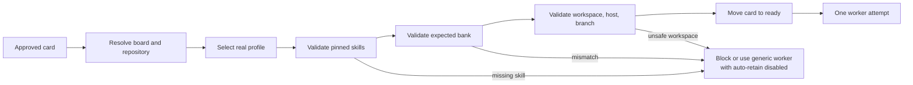

A future routing manifest should include:

```yaml
projects:
  logk:
    board: logk
    repository:
      jellyberry: /home/jellybot/dev_projects/logk
      jellybase: /home/jellydev/dev_projects/logk
    memory:
      bank: logk-main
      automatic_retain: project-profile-only
    routes:
      implementation:
        profile: jellybase_logk
        skills: [implement, tdd]
      review:
        profile: jellybase_logk_reviewer
        skills: [code-review]
        auto_retain: false
```

This is proposed configuration, not current runtime state.

### 1A.8 Memory source priority

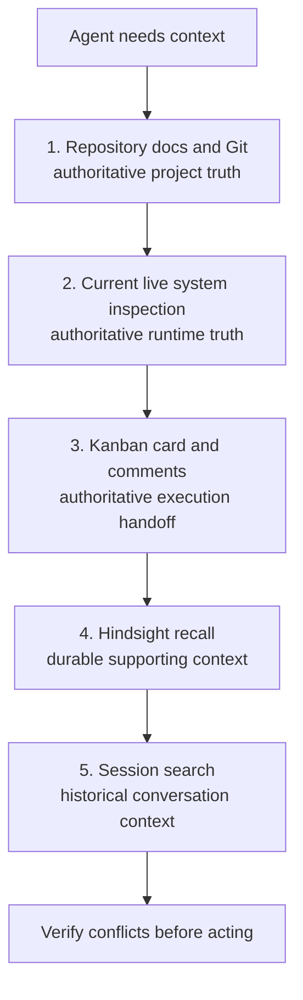

Retain in Hindsight:

- Stable architecture decisions.
- Recurring operational facts.
- Durable environment constraints.
- Repeated pitfalls and verified resolutions.
- Project conventions likely to matter across sessions.

Keep out of Hindsight:

- Ready/running counts.
- Task IDs and transient branch status.
- PIDs, temporary paths, and raw logs.
- “Review currently running.”
- One-off test output.
- Unverified agent claims.

### 1A.9 Bank maintenance is part of the control plane

The active TUI session established two read-only deterministic maintenance jobs:

```text
Daily 03:45   alert-only Hindsight watchdog
Monday 03:50  full Hindsight summary
```

They report through the configured Discord operations topic and write local Markdown/JSON reports under:

```text
/home/jellybot/projects/hindsight-maintenance/reports/
```

Checks include:

- Hindsight API, version, and OpenAPI health.
- Profile memory-provider availability.
- Expected profile-to-bank configuration.
- Stuck asynchronous operations.
- Prefetch visibility warnings.
- Runtime image and 1 GiB container shared memory.
- Source-repository drift.

Destructive cleanup remains outside automation:

```text
backup
  → read-only candidate report
  → operator review
  → targeted invalidate/delete
  → recall verification
  → rollback if needed
```

After changing profile memory configuration, start a fresh CLI/Desktop/Kanban worker session. Existing provider instances can retain the old bank or timeout settings.

---

## 2. Authority and ownership

Each concern has one authoritative home. Do not duplicate live state across systems.

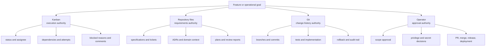

### 2.1 Hermes Kanban owns

- Current task status.
- Current assignee.
- Dependency edges.
- Execution attempts, retries, and worker logs.
- Blocked reasons and human responses.
- Concise handoff comments.
- Reported branch, commit, tests, and review outcome.

### 2.2 Repository files own

Recommended convention, adapted to each repository's existing structure:

```text
CONTEXT.md

docs/
├── adr/
├── specs/
├── tickets/
├── plans/
├── reviews/
├── runbooks/
└── agents/
```

These files preserve:

- Domain language and project constraints.
- Architectural decisions.
- Feature specifications and non-goals.
- Durable ticket definitions and acceptance criteria.
- Test and verification plans.
- Independent review reports where the decision merits a durable record.
- Project-specific agent and operator conventions.

### 2.3 Git owns

- Code and documentation.
- Branches, worktrees, and commits.
- Durable change history.
- Rollback points.
- Pull requests where they add value.

### 2.4 Operator owns

- Scope and product decisions.
- Moving selected work into executable state.
- Sudo, credentials, secrets, and production approvals.
- Pull-request creation, merge, release, and deployment decisions.

### 2.5 Avoid dual-source drift

Do not mirror live Kanban status into Markdown checkboxes.

Example:

```text
docs/tickets/export/03-stream-results.md
    └── defines the work and acceptance criteria

Hermes Kanban card t_...
    └── owns todo / ready / running / blocked / done
```

Kanban SQLite data is protected through the separate `~/.hermes` backup practice. Live board databases should not be copied into individual project repositories.

---

## 3. Board topology

Use one board per persistent repository or durable operational workstream, not one board per idea.

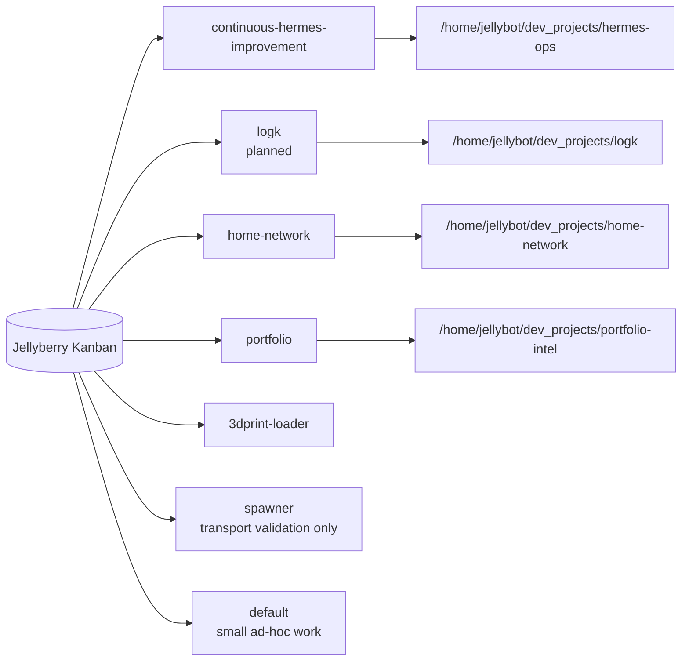

### 3.1 Recommended board decisions

- Keep `continuous-hermes-improvement` as the Hermes control-plane and infrastructure board. Do not create a duplicate `hermes-infra` board.
- Add `logk` for LogK development.
- Keep `home-network` for homelab and network work.
- Keep `portfolio` for the existing portfolio workstream.
- Keep `3dprint-loader` for that repository.
- Keep `spawner` only for transport, profile, and dispatch acceptance tests.
- Reserve `default` for bounded ad-hoc work that does not justify a persistent board.
- Add another board only when the workstream has independent scope, backlog, repository context, and lifecycle.

### 3.2 Cross-board work

Hermes does not provide cross-board dependency edges. Coordinate cross-project work with:

- A parent orchestration record in one selected board.
- Links to durable specifications in the affected repositories.
- Explicit card references in comments.
- A final operator reconciliation step.

Do not pretend independent boards form one distributed dependency graph.

---

## 4. Current live-state corrections

These corrections are prerequisites, not approved changes merely because they appear in this document.

### 4.1 Stale board project directories

The directory migration left these board metadata paths behind:

```text
Current board metadata                  Required path
─────────────────────────────────────   ───────────────────────────────────────────────
/home/jellybot/hermes-ops               /home/jellybot/dev_projects/hermes-ops
/home/jellybot/home-network             /home/jellybot/dev_projects/home-network
/home/jellybot/portfolio-intel          /home/jellybot/dev_projects/portfolio-intel
```

The current paths no longer exist and must be corrected before dispatching repository work.

### 4.2 Invalid ready-card assignee

A ready card currently exists on `continuous-hermes-improvement` with:

```text
Title:    Check Docker health on Jellybase
ID:       t_dbcf7e2c
Assignee: jellybase
Status:   ready
```

`jellybase` is not an installed profile. The real execution profile is `jellybase_hermes`. The card must be reassigned, blocked, archived, or otherwise reconciled before normal dispatch resumes.

### 4.3 Current automation is too aggressive for the pilot

Observed configuration:

```yaml
kanban:
  auto_decompose: true
  auto_decompose_per_tick: 3
  orchestrator_profile: jellybase_hermes
  default_assignee: jellybase_hermes
  max_in_progress: 2
  max_spawn: 2
```

Recommended pilot policy:

```yaml
kanban:
  auto_decompose: false
  orchestrator_profile: ""
  default_assignee: ""
  max_in_progress: 1
  max_spawn: 1
```

Reasons:

- `jellybase_hermes` is an implementation worker, not a restricted orchestration profile.
- Automatic decomposition can create and route work before the profile and skill map is mature.
- Concurrency limits apply per board, so several active boards can exceed the intended host-wide load.
- Explicit assignees make routing auditable.
- Moving only operator-approved cards to `ready` provides the initial execution gate.

### 4.4 Host path convention

Use the same home-relative convention on each agent host, while allowing usernames to differ:

```text
Jellyberry: /home/jellybot/dev_projects/<repo>
Jellybase:  /home/jellydev/dev_projects/<repo>
Jellyhome:  /home/jellydev/dev_projects/<repo>
```

Existing multi-agent documents still reference `/home/jellydev/src/<repo>`. Reconcile those references before using the new convention operationally.

A Jellyberry Desktop Project path must remain visible to Jellyberry. A remote execution path is separate and belongs in the card or routing manifest.

---

## 5. Profiles, agents, and specialists

### 5.1 Terms

```text
Profile       Stable Hermes identity and configuration on Jellyberry
Agent engine  Hermes, OpenCode, Claude Code, Codex, or another executable
Specialist    Stable domain or safety role represented by a profile or skill
Skill         Procedure/context loaded for one task or profile
Host          Machine on which tools ultimately execute
Attempt       One worker run against one Kanban card
```

A profile is not automatically a machine, OS user, or security sandbox. Its real authority is determined by the Jellyberry Linux account and the configured tool/backend boundaries.

### 5.2 Initial profile roster

#### `default`

Operator-facing control profile:

- Discuss requirements and decisions.
- Run interactive design flows.
- Create and inspect cards.
- Coordinate review and report results.
- Avoid unattended implementation when acting as orchestrator.

#### `jellybase_hermes`

Current generic remote implementation worker and baseline:

- Uses the reviewed Jellybase SSH backend.
- Operates as non-privileged `jellydev`.
- Blocks when sudo, credentials, production access, or unclear local changes are encountered.
- Uses `jellybase-worker-main` with automatic retention disabled.
- Remains appropriate for occasional bounded cross-project work where repository documents carry all project context.

#### `jellybase_logk` — proposed

LogK implementation specialist cloned from the reviewed worker baseline:

- Uses the same Jellybase SSH and no-sudo boundaries.
- Operates only in the approved LogK checkout and branch.
- Uses `logk-main` for project-scoped recall and durable retention.
- Inspects repositories, changes code, runs tests, commits, and pushes only the specified branch.
- Blocks when credentials, production access, or unclear local changes are encountered.

#### `homenetworkworker`

Home-network specialist:

- Handles bounded homelab documentation, monitoring, backups, runbooks, and approved maintenance.
- Carries domain-specific context and safety rules through `home-network-main`.
- Should receive Matt development skills only when it is expected to perform software-development cards.

#### `jellybase_logk_reviewer` — proposed

Independent LogK review specialist:

- Fresh profile and session context.
- Uses `logk-main` for recall with automatic retention disabled.
- Exact branch and commit supplied on the card.
- Separate checkout or worktree.
- Read-only review contract.
- No edit, commit, push, PR, merge, sudo, or deployment.
- Reports `PASS`, `BLOCKED`, or numbered findings.

#### `logk_opencode` — possible later

External-agent adapter profile:

- Is a real Jellyberry Hermes profile and therefore a valid Kanban assignee.
- Invokes OpenCode on Jellyhome through a reviewed adapter.
- Uses `logk-main` with automatic retention disabled until adapter output quality is proven.
- Has a separate LogK checkout or worktree.
- Carries the `opencode` skill plus approved Matt workflow skills.
- Returns structured results and completes or blocks the card through Hermes.

### 5.3 When a new profile is justified

Create a profile only when at least one stable boundary differs:

- Host or SSH backend.
- OS user or credentials.
- Tool access.
- Memory bank and retention policy.
- Safety contract.
- Durable domain role.
- Independent-review boundary.

Use task-pinned skills when only the procedure changes. Avoid creating profiles named after every transient phase.

---

## 6. Matt Pocock skills as the development engine

### 6.1 Routing model

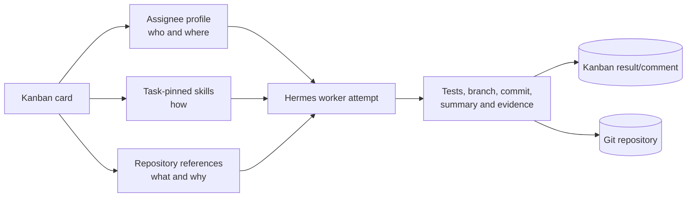

The key mechanism is:

```text
Kanban card
├── assignee = who and where executes
└── skills   = how the work is performed
```

A skill does not select or launch an external agent by itself. The orchestrator selects a real profile, and the card pins skills already installed for that profile.

### 6.2 Native task skill pinning

From an orchestrator:

```text
kanban_create(
    title="Implement structured export",
    assignee="jellybase_logk",
    skills=["implement", "tdd"],
)
```

From the CLI:

```bash
hermes kanban --board logk create \
  "Implement structured export" \
  --assignee jellybase_logk \
  --skill implement \
  --skill tdd
```

The dispatcher loads the listed skills when it starts the worker.

### 6.3 Skill availability constraint

The named skills must already be installed for the assignee profile.

Current availability relevant to this design:

- `default`: required Matt engineering skills are available.
- `jellybase_hermes`: required Matt engineering skills are available and provide the baseline for the proposed LogK profiles.
- `homenetworkworker`: Matt engineering skills are not currently installed.
- `jellybase_logk` and `jellybase_logk_reviewer`: proposed; they must not receive cards until created, bank-verified, and skill-verified.

A task assigned to `homenetworkworker` with `--skill implement` would therefore fail before useful work began.

### 6.4 Three skill layers

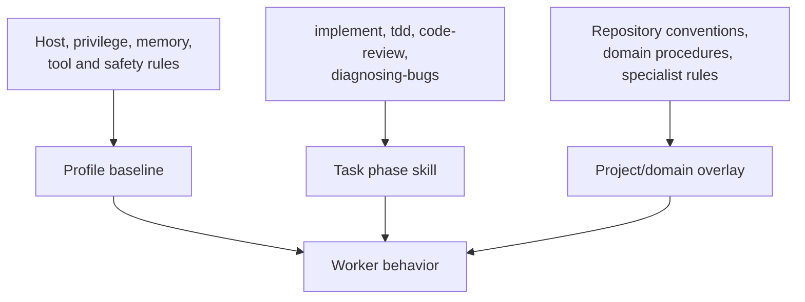

#### Profile baseline

Stable safety and execution identity:

- SSH backend.
- No-sudo rule.
- Memory policy.
- Tool restrictions.
- Domain scope.

#### Task phase skill

Selected per card:

- `implement`
- `tdd`
- `code-review`
- `diagnosing-bugs`
- other bounded workflow skills

#### Project/domain overlay

Use repository context first:

- `AGENTS.md`
- `CLAUDE.md`
- `CONTEXT.md`
- `docs/agents/`
- `docs/adr/`

Create a project skill only when the project has a reusable procedure that is not adequately expressed by repository documentation. Install that skill on every profile expected to receive it.

### 6.5 Proposed bridge skill

After this architecture is approved, create a small `matt-kanban-development` orchestration skill for the operator/default profile.

It should:

1. Discover real profiles and their installed skills.
2. Resolve the project board and repository mappings.
3. Require an approved specification or explicitly invoke the interactive design flow.
4. Convert durable tickets into Kanban cards.
5. Pin phase skills explicitly.
6. Assign only real profiles.
7. Construct dependency edges.
8. Add an independent review and final acceptance gate.
9. Stop after creating the graph; it must not implement the cards itself.

Do not fork or rewrite the underlying Matt skills. The bridge should compose them and encode the local Kanban conventions.

---

## 7. Development lifecycle

### 7.1 Interactive and unattended boundaries

Interactive phases need user dialogue and should normally run in the operator-facing session:

```text
setup-matt-pocock-skills  # once per repository
        ↓
grill-with-docs
        ↓
to-spec
        ↓
to-tickets
```

Unattended worker phases operate on approved, bounded cards:

```text
implement + tdd
        ↓
code-review
        ↓
fix card if required
        ↓
fresh code-review
        ↓
final acceptance
```

### 7.2 Dependency graph

Hermes dependency links mean a child waits for its parent to become `done`. They are execution edges, not a general visual hierarchy.

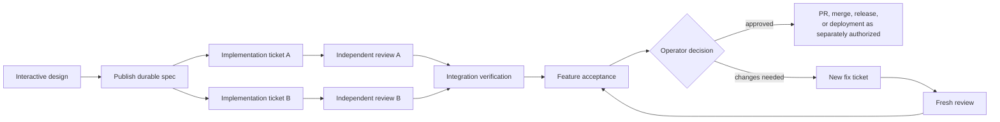

A feature umbrella card can index the specification and related card IDs, but it should not be used as a blocking dependency parent unless completing it is intentionally the prerequisite for all children.

### 7.3 Implementation card

```text
Assignee: jellybase_logk
Skills: implement, tdd

Required references:
- Board and repository.
- Local and remote repository paths.
- Exact branch.
- Specification path.
- Ticket path.
- Acceptance criteria.
- Required tests and checks.
- Expected Hindsight bank or explicit no-auto-retain policy.
- Final report fields.
```

The implementation worker performs a self-review, but that does not replace independent review.

### 7.4 Hard-bug card

```text
Assignee: jellybase_logk
Skills: diagnosing-bugs, tdd
```

The card should include the observed failure, reproduction command, expected behavior, scope boundary, and stop conditions.

### 7.5 Independent review card

```text
Assignee: jellybase_logk_reviewer
Skills: code-review
Parents: implementation card

Read-only inputs:
- Exact pushed branch.
- Expected commit.
- Specification and ticket.
- Required non-mutating checks.
```

### 7.6 Review-fix loop

Create a new fix card for real findings. Do not simply rerun or reassign the original implementation card.

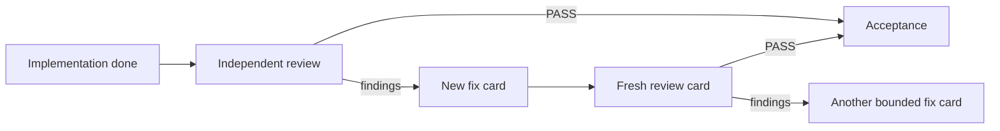

### 7.7 Meaning of `done`

A stage card may be `done` when that stage has produced and verified its declared result. It does not mean the whole feature is approved.

The final acceptance card should require:

- Required implementation cards completed.
- Focused and project-level checks passed.
- `git diff --check` passed where applicable.
- Branch and exact commit recorded.
- Independent review passed.
- Review fixes received a fresh review.
- Required repository documents exist.
- The operator's approval requirements are satisfied.

---

## 8. Remote execution boundary

### 8.1 Supported pattern

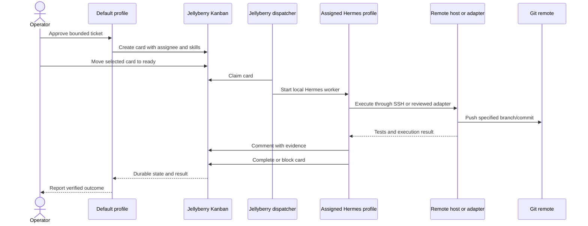

### 8.2 Why direct remote assignees are rejected

OpenCode, Claude Code, Codex, and a separate Hermes installation do not automatically become Hermes profiles.

A separate Hermes installation on another host has its own:

- Profiles.
- Sessions.
- Gateway.
- Kanban database.
- Cron jobs.
- Local state.

It does not automatically join Jellyberry's board fleet.

### 8.3 External-agent adapter

The supported later pattern is:

```text
Jellyberry Kanban
  → local Hermes adapter profile
  → SSH or authenticated agent service
  → remote OpenCode/Claude/Codex process
  → result returned to local Hermes profile
  → local profile updates the Jellyberry card
```

The adapter must provide:

- Stable invocation.
- Explicit repository and branch.
- Timeout and cancellation.
- Liveness and failure reporting.
- Structured result extraction.
- No secret values in logs or card comments.
- One writer per checkout/worktree.

Tmux may be an implementation detail for an external long-running CLI. It is not the primary state store, and it is not needed to replace the native Kanban worker lifecycle.

---

## 9. Repository and workspace policy

### 9.1 Project mapping

Maintain a reviewed mapping rather than assuming one absolute path exists on every host.

Conceptual example:

```yaml
projects:
  logk:
    board: logk
    jellyberry_repo: /home/jellybot/dev_projects/logk
    memory_bank: logk-main
    preferred_profiles:
      implementation: jellybase_logk
      review: jellybase_logk_reviewer
    execution_targets:
      jellybase: /home/jellydev/dev_projects/logk
      jellyhome: /home/jellydev/dev_projects/logk
    durable_paths:
      specs: docs/specs
      tickets: docs/tickets
      decisions: docs/adr
      reviews: docs/reviews
```

This is a design example, not an implemented configuration file.

### 9.2 Workspace rules

- A Desktop Project path must exist on Jellyberry for a Jellyberry-backed session.
- A remote execution profile needs a repository checkout on its execution host.
- Do not use Hermes local Kanban worktree mode for `jellybase_hermes` until remote workspace mapping is deliberately implemented and verified.
- State the exact remote path and branch in every remote implementation card.
- Use one editing worker per checkout and branch.
- Use separate worktrees or clones for independent review and parallel work.
- Preserve existing uncommitted and untracked files; block rather than overwrite unknown work.

### 9.3 Durable card references

Each implementation or review card should link to repository files instead of carrying a giant duplicated prompt:

```text
Specification: docs/specs/structured-export.md
Ticket:        docs/tickets/structured-export/03-stream-results.md
Decision:      docs/adr/0012-export-format.md
Review output: docs/reviews/structured-export-commit-<short-sha>.md
```

Comments should summarize the handoff and record exact evidence, not replace the durable artifacts.

---

## 10. Routing policy

### 10.1 Deterministic selection order

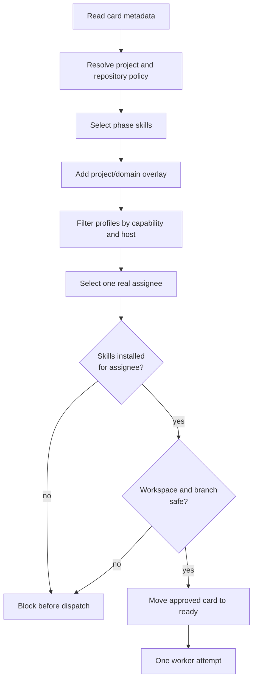

### 10.2 Suggested LogK pilot routes

```yaml
routes:
  interactive_design:
    profile: default
    skills: [grill-with-docs]

  specification:
    profile: default
    skills: [to-spec]

  ticketing:
    profile: default
    skills: [to-tickets]

  application_implementation:
    profile: jellybase_logk
    bank: logk-main
    skills: [implement, tdd]

  hard_bug:
    profile: jellybase_logk
    bank: logk-main
    skills: [diagnosing-bugs, tdd]

  home_network_operations:
    profile: homenetworkworker
    skills: []

  independent_review:
    profile: jellybase_logk_reviewer
    bank: logk-main
    auto_retain: false
    skills: [code-review]
```

This is the proposed policy, not current runtime configuration.

### 10.3 Profile descriptions

Hermes's decomposer uses profile descriptions for routing. Keep descriptions short, capability-based, and explicit about boundaries.

Do not enable automatic decomposition until:

- Every routable profile exists.
- Descriptions are reviewed.
- Required skills are installed on those profiles.
- Expected Hindsight banks and retention modes are verified in fresh sessions.
- The routing policy has passed manual pilot cards.
- Unknown-profile and missing-skill behavior is proven fail-closed.

---

## 11. Critical review of the source proposal

### 11.1 Accepted

- Jellyberry as the single control plane.
- Kanban as the central execution queue.
- One board per durable project or workstream.
- The board owns the task; the worker owns an attempt.
- Git as the code handoff and durable change history.
- Persistent comments and structured result summaries.
- Explicit blocked states for human decisions.
- Separate implementation and review stages.
- Role- and capability-based routing.
- Incremental rollout before autonomous pipelines.
- The principle of **jobs + Git + results**, rather than agents holding endless unstructured conversations.

### 11.2 Modified

#### Agent engines as assignees

The assignee must be a real Hermes profile. The underlying engine is an implementation detail behind that profile.

```text
Correct:
  assignee = logk_opencode
  engine   = OpenCode on Jellyhome

Incorrect:
  assignee = arbitrary remote OpenCode process
```

#### Remote-host semantics

The board remains local to Jellyberry. Remote tools are reached from a local Hermes worker through SSH or an adapter.

#### Comments as agent communication

Comments are concise handoff and evidence records. Specifications, detailed tickets, decisions, and substantial review reports belong in repository files.

#### Shared project paths

Standardize `~/dev_projects/<repo>` conceptually, but keep an explicit host mapping because usernames and filesystems differ.

#### Feature parent cards

Dependency links are execution prerequisites, not merely hierarchy. Use a final acceptance fan-in card rather than assuming an umbrella parent will automatically represent feature completion.

#### `done` semantics

A stage card being done proves only that stage's declared completion criteria. Feature acceptance requires the full gate.

### 11.3 Rejected for the initial system

- A custom job registry duplicating Kanban IDs, state, logs, retries, and results.
- Direct arbitrary SSH strings as the public orchestration interface.
- Tmux as the primary state store.
- Automatic planner → developer → reviewer pipelines before a manual pilot.
- Naming profiles after transient phases when a task-pinned skill is sufficient.
- Treating independent host-local Kanban databases as one distributed board.
- Assuming a card's `done` state is independent proof of a branch, commit, push, or test result.
- Automatic PR creation, merging, release, deployment, sudo, or secret use.

---

## 12. Safety and failure handling

### 12.1 Required safety rules

- No sudo by default for development workers.
- Treat Docker access as privileged because it is effectively root-equivalent.
- Keep credentials out of card bodies, comments, result files, and repository documents.
- Use dedicated development checkouts, not production runtime trees.
- Preserve unknown local changes and block for operator direction.
- Permit only the repository, branch, host, and operations named by the card.
- Require explicit approval for PRs, merge, release, deployment, privileged changes, or new credentials.

### 12.2 Card lifecycle on failure

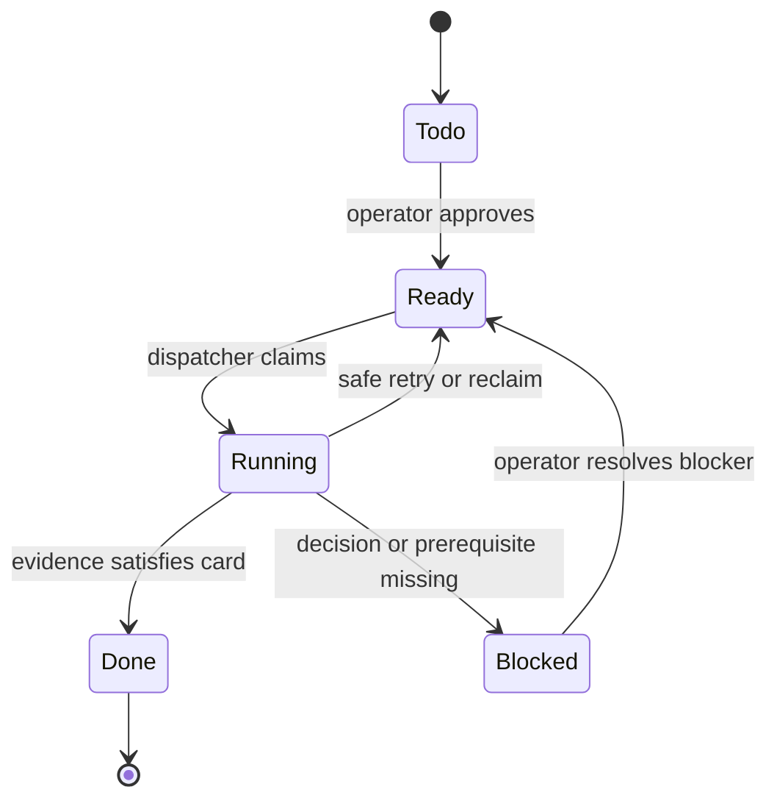

A retry is a new attempt against the same task when scope and acceptance criteria remain unchanged. Create a new card when the work itself changes, such as a review finding requiring a bounded fix.

### 12.3 Evidence required from a worker

A completion comment or result should include:

```text
Status: completed | blocked
Repository:
Branch:
Commit:
Push result:
Files changed:
Checks run:
Exact results:
Review required:
Durable artifact paths:
Limitations or blockers:
```

The operator or reviewer must independently verify material claims when promotion, release, comparison, or deployment depends on them. Card state alone is not proof.

---

## 13. Phased implementation plan

### Phase 0 — repair the current control plane

Actions:

1. Correct the three stale board project directories.
2. Repair or recreate the stale LogK and Diagram Creator Desktop Project paths.
3. Reconcile the invalid ready-card assignee.
4. Disable automatic decomposition for the pilot.
5. Reduce per-board concurrency to one.
6. Remove `jellybase_hermes` as the automatic orchestration owner/fallback.
7. Reconcile `/home/jellydev/src` documentation with the `~/dev_projects` convention.
8. Publish the explicit board → repository → profile → bank map.
9. Verify every routable profile reports Hindsight available and the expected bank.

Completion criteria:

- Every active board points to an existing intended path or intentionally has no default project directory.
- Every active Desktop Project points to a Jellyberry-visible path that exists.
- Every ready/running card names an installed profile.
- Every persistent project declares its memory bank or explicit no-auto-retain route.
- Every routable profile reports Hindsight available and the expected bank.
- No card is dispatched automatically during the manual pilot.
- One approved card results in at most one active worker on its board.

### Phase 1 — finalize the repository contract

Actions:

1. Update this multi-agent guide to make the authority boundaries normative.
2. Define the repository artifact convention.
3. Configure each participating repository's Matt workflow.
4. Use a custom tracker policy: Hermes Kanban for execution state plus versioned repository files for durable specifications and tickets.
5. Create the `matt-kanban-development` bridge skill after approval.

Completion criteria:

- Each pilot repository contains or links to its project context, specification path, ticket path, and agent rules.
- The bridge skill creates valid cards only for installed profiles and installed skills.
- The skill stops after orchestration and does not implement work itself.

### Phase 2 — introduce a LogK-specific implementation and review pair

Actions:

1. Create `jellybase_logk` from the reviewed Jellybase worker baseline.
2. Bind `jellybase_logk` to `logk-main` and install only the approved implementation and LogK skills.
3. Create `jellybase_logk_reviewer` with the same project bank but `auto_retain: false`.
4. Give the reviewer a read-only review SOUL and narrowly scoped tools.
5. Provide separate implementation and review checkouts or worktrees.
6. Install `code-review` and required repository context on the reviewer.
7. Test both profiles against exact commits before using Kanban dispatch.

Completion criteria:

- Both profiles report Hindsight available and `logk-main` as the expected bank.
- The reviewer cannot accidentally share the implementer's active working tree.
- The reviewer does not automatically retain each review run.
- It reports against an exact branch and commit.
- It produces `PASS`, `BLOCKED`, or numbered findings.
- A fresh rereview is used after fixes.

### Phase 3 — pilot LogK through native Hermes profiles

Actions:

1. Create the `logk` board.
2. Associate it with `/home/jellybot/dev_projects/logk` for Jellyberry-visible context.
3. Prepare the Jellybase checkout under the agreed remote root.
4. Select one small, reversible feature or bug.
5. Run the interactive Matt design/spec/ticket flow.
6. Confirm the specification and ticket are available in the repository before relying on Hindsight recall.
7. Create one implementation card assigned to `jellybase_logk` with explicit skills and expected bank `logk-main`.
8. Move only that card to `ready`.
9. Create and run one dependent card assigned to `jellybase_logk_reviewer`.
10. Verify branch, commit, push, tests, profile bank, review, comments, and durable documents.
11. Stop before PR creation or merge.

Completion criteria:

- One approved ticket travels from repository specification to implementation, independent review, and final acceptance.
- Failure, block, and retry behavior are understood.
- No unrelated checkout or branch is modified.
- Reported Git and test evidence is independently verified.

### Phase 4 — add OpenCode as an adapter-backed lane

Actions:

1. Create a real Jellyberry Hermes adapter profile for LogK.
2. Bind it to `logk-main` with `auto_retain: false` until adapter output quality is proven.
3. Connect it to the reviewed OpenCode service or CLI on Jellyhome.
4. Install `opencode` and the approved Matt/project skills for that profile.
5. Use a separate LogK checkout or worktree.
6. Run one bounded implementation card.
7. Test completion, block, timeout, cancellation, malformed-result, and wrong-bank behavior.

Completion criteria:

- The local Hermes profile remains the sole Kanban assignee and result writer.
- OpenCode receives only the approved repository, branch, ticket, and tools.
- Cancellation and failure return the card to a safe, inspectable state.
- No secret is exposed in logs or card history.

### Phase 5 — consider controlled automation

Only after several successful manual pipelines:

1. Add a restricted orchestrator profile with board-oriented tools.
2. Test manual decomposition through that profile.
3. Review profile descriptions and capability routing.
4. Test missing-profile, missing-skill, and cross-board failure cases.
5. Consider enabling automatic decomposition with strict limits.

Completion criteria:

- Generated graphs are predictable and small.
- Every assignee and skill is validated before dispatch.
- Automatic work cannot bypass the operator's ready gate, privilege rules, or review gate.
- Concurrency remains bounded across active boards.

---

## 14. Decision package

The proposed final design is:

> **Jellyberry-hosted, multi-board Hermes Kanban; repository-backed specifications, tickets, decisions, and evidence; central Hindsight on Jellyhome with explicit global, role, and project-bank routes; manually approved Matt Pocock development flows; real Hermes profiles as assignees; task-pinned workflow skills; SSH-backed remote execution; project-bound implementation and review profiles where durable memory is required; and external coding agents added later through profile-owned adapters.**

### Decisions to approve

- [ ] Jellyberry remains the sole Kanban control plane.
- [ ] Hindsight remains centralized on Jellyhome with scoped global, role, and project banks.
- [ ] Every persistent project declares an explicit memory route.
- [ ] Desktop Projects and sessions do not switch Hindsight banks implicitly.
- [ ] Project-specific profiles are used when automatic project-bank recall or retention is required.
- [ ] Generic implementation and reviewer profiles default to conservative or disabled automatic retention.
- [ ] Repository and live-system evidence override conflicting recalled memory.
- [ ] Repository files are authoritative for specs, tickets, ADRs, and durable review evidence.
- [ ] Kanban is authoritative for status, dependencies, assignees, attempts, comments, and blocked reasons.
- [ ] Initial orchestration is manual with one executable card at a time.
- [ ] `continuous-hermes-improvement` remains the Hermes infrastructure board.
- [ ] A dedicated `logk` board is added for the first pilot.
- [ ] Skills are pinned explicitly to cards and must exist on the assignee profile.
- [ ] Project specialists are added only for stable host, tool, domain, memory, or safety boundaries.
- [ ] `jellybase_logk` and `jellybase_logk_reviewer` are the first project-bound specialist pair.
- [ ] External OpenCode integration is deferred until the native Hermes pipeline passes.
- [ ] PR creation, merge, release, deployment, sudo, and secret use remain operator-controlled.

### First practical action after approval

Execute **Phase 0 only**, verify the corrected board/profile state, and report the exact changes before creating the LogK pilot board or dispatching development work.

---

## 15. Authoritative references

- Hermes Kanban documentation: <https://hermes-agent.nousresearch.com/docs/user-guide/features/kanban>
- Applied Hindsight routing decision: [../../reports/hindsight-bank-routing-2026-08-08.md](../../reports/hindsight-bank-routing-2026-08-08.md)
- Memory hygiene and bank policy: [../../runbooks/memory-hygiene-runbook.md](../../runbooks/memory-hygiene-runbook.md)
- Hermes Projects, profiles, and sessions: [../hermes-desktop-projects-profiles-and-sessions.md](../hermes-desktop-projects-profiles-and-sessions.md)
- Local multi-agent guide index: [README.md](README.md)
- Safety and architecture: [architecture-and-safety-boundaries.md](architecture-and-safety-boundaries.md)
- Feature lifecycle: [feature-lifecycle.md](feature-lifecycle.md)
- Matt Pocock skills: [matt-pocock-skills.md](matt-pocock-skills.md)
- Kanban templates: [kanban-card-templates.md](kanban-card-templates.md)
- Operator checklist: [operator-checklist.md](operator-checklist.md)
