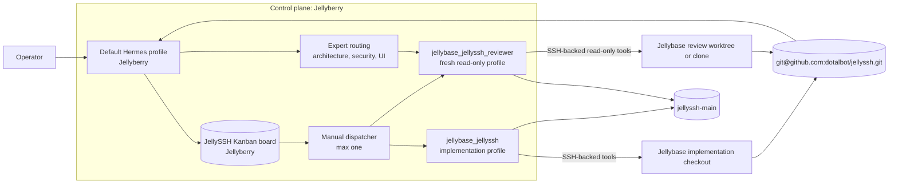

# Jellyberry Kanban orchestration design — V3: JellySSH pilot and expert-agent governance

> **Status:** Operator-approved design; Phases 0, 1, 2, 2.5, and the first Phase 3 JellySSH pilot accepted; lifecycle infrastructure PR and one repeatability pilot preparation authorized
>
> **Based on:** V2 plus the operator's LogK exclusion, JellySSH pilot selection, live Jellyhome LogK/OpenCode inspection, and read-only JellySSH repository intake
>
> **Checked:** 2026-08-12 after BUG-008 merge and reconciliation
>
> **Original design approval:** Approved in the Hermes CLI session on 2026-08-09 with Phase 0 as the first authorized action.
>
> **Phase transition:** Phase 0 accepted and Phase 1 authorized by the operator on 2026-08-09.
>
> **Phase transition:** Phase 1 was accepted and Phase 2 setup was authorized by the operator on 2026-08-09.
>
> **Phase transition:** Phase 2 was accepted, merged into the repository default branch, and Phase 2.5 Skills Manager/Project Setup work was authorized by the operator on 2026-08-09.
>
> **Phase transition:** The operator authorized the first Phase 3 JellySSH pilot; BUG-008 completed the governed path and PR #2 merged on 2026-08-12. The operator then authorized preparing the lifecycle-infrastructure PR and one second small JellySSH pilot to prove repeatability. Merging the Hermes-ops PR, product PR/merge, LogK work, privilege use, release, signing, sideloading, and deployment remain separate gates.
>
> **Implementation state:** Phase 0 corrections, Phase 1 governance, Phase 2 setup/routing, Phase 2.5 project/skill controls, lifecycle-aware dispatch preflight, compact reviewer evidence, and the first Phase 3 JellySSH pilot are complete. V1 and V2 remain preserved separately.

## What V3 changes

V3 preserves the V2 control-plane, authority, safety, memory, and evidence model, but changes the rollout:

1. JellySSH replaces LogK as the manual pilot.
2. JellySSH development runs on Jellybase through Jellyberry-owned Hermes profiles.
3. LogK is excluded from the pilot and remains read-only until explicitly authorized.
4. Future LogK development stays on Jellyhome through OpenCode, with Hermes owning orchestration through a reviewed adapter.
5. The development method combines Matt Pocock workflows with the specialist and pause-gated method already used by LogK.
6. Skills, experts, profiles, models, and project instructions are treated as separate routing dimensions.
7. Upstream and local skills require controlled inventory, update, compatibility, and promotion procedures.
8. Final independent review uses a different approved model/provider family from implementation when available, plus a fresh read-only context against an exact commit; model unavailability blocks for operator decision rather than causing silent fallback.

The governing rule remains:

> **The board owns the task. A worker owns one execution attempt. Git and repository documents preserve the durable result. Hindsight preserves scoped reusable knowledge. The operator controls promotion.**

---

## 1. Approved direction and hard boundaries

### 1.1 Control plane

- Jellyberry is the sole Hermes Kanban control plane.
- Board databases, dispatcher state, claims, attempts, logs, dependencies, and comments remain on Jellyberry.
- A Kanban assignee is a real Hermes profile on Jellyberry.
- Remote execution occurs through a profile's SSH backend or a reviewed adapter.
- Execution route, agent type, host, model, and skills are selected per project and work-item role from the approved project manifest; no engine or model is globally primary.
- A selected route may use a Hermes worker, a local advisory agent, or a reviewed remote adapter, but the card must state the route and its preflight/evidence contract.
- Remote OpenCode, Claude Code, Codex, or another engine is not itself a Jellyberry Kanban assignee.

### 1.2 Pilot boundary

The pilot project is:

```text
Project:       JellySSH
Git remote:    git@github.com:dotalbot/jellyssh.git
Control plane: Jellyberry
Execution:     Jellybase
Memory bank:   jellyssh-main
Mode:          manual, one executable card at a time
```

The pilot must begin with a small, reversible, non-security-critical ticket. Credential storage, host-key trust, agent forwarding, cloud sync, ProxyJump, Mosh transport, port forwarding, and release signing are poor first-ticket candidates.

### 1.3 LogK boundary

LogK is explicitly outside the pilot:

```text
Project:       LogK
Development:   Jellyhome
Engine:        OpenCode
Control:       future Jellyberry Hermes adapter
Memory bank:   logk-main
Current mode:  read-only until separately authorized
```

Do not create `jellybase_logk`, dispatch LogK cards to Jellybase, or use LogK to prove the pilot. The current Jellyhome OpenCode workflow is reference material for the combined method, not a target for modification.

Reference inspection of LogK remains strictly read-only: repository status, documentation, agent definitions, and configuration may be read; no LogK file, branch, worktree, session configuration, runtime, test artifact, or Hindsight route may be changed. Re-check this boundary before every future LogK inspection.

### 1.4 Operator gates

The operator retains authority over:

- Moving selected work to `ready`.
- Sudo, Docker, credentials, and secret access.
- Security-sensitive scope.
- Repository pushes where project policy requires confirmation.
- PR creation, merge, release, signing, sideloading, and deployment.
- Skill updates and expert/model changes promoted into active profiles.

Each phase below requires an explicit operator decision after its completion evidence is reported. Completion criteria do not auto-authorize the next phase.

---

## 2. Target architecture



Editable full operating overview: [`skills-manager-operating-overview.drawio`](../../../diagram_creator/artifacts/source/skills-manager-operating-overview.drawio). It contains separate pages for the operating map, project setup, and shared-skill lifecycle.

The reviewer is bound to `jellyssh-main`, but Phase 2 disables both automatic recall and automatic retention so recalled text cannot contaminate an exact-commit verdict and transient review chatter is not stored. The bank binding remains available for a later separately reviewed policy change. Repository documents and current Git state remain authoritative.

### 2.1 Compact route

```text
approved JellySSH ticket
  → Jellyberry Kanban card
  → real Jellyberry Hermes profile
  → pinned workflow skills and conditional experts
  → isolated Jellybase checkout/branch
  → tests and exact commit
  → fresh read-only review, preferably on a different model
  → operator acceptance
```

### 2.2 Authority model

```text
Repository documents   requirements, specs, ADRs, project rules
Git                    code, branches, commits, rollback, durable diff
Kanban                 status, assignee, dependencies, attempts, blockers
Hermes profile         identity, host, tools, memory route, safety boundary
Task-pinned skill      procedure for the current phase
Expert binding         specialist role, model, tools, and review contract
Hindsight              scoped reusable project and operational knowledge
Operator               scope, approvals, promotion, release decisions
```

In this document, a **worker attempt** means one execution process launched for one Kanban card under an assigned Hermes profile. The profile is the stable identity; the worker is the disposable attempt.

---

## 3. Read-only JellySSH intake

The repository was inspected through an ephemeral, no-checkout Git fetch. No persistent JellySSH checkout or working tree was created on Jellyberry or Jellybase.

### 3.1 Verified repository facts

```text
Remote:         git@github.com:dotalbot/jellyssh.git
Default branch: main
Visibility:     private (SSH access succeeded; unauthenticated GitHub API returned not found)
Application:    Flutter / Dart SSH client
Primary target: Android, especially Xiaomi Pad 7
App root:       app/
```

Core stack:

- Flutter and Dart.
- `dartssh2` for SSH.
- Flutter `xterm` for terminal rendering.
- Drift/SQLite for non-sensitive local configuration.
- Riverpod for state management.
- `go_router` for navigation.
- `flutter_secure_storage` for credentials.

### 3.2 Existing repository authority

JellySSH already has substantial agent-ready project documentation:

```text
CLAUDE.md
opencode.json
.opencode/
docs/ROADMAP.md
docs/DECISIONS.md
docs/specifications/
docs/bugs/
docs/ai/project-memory.md
docs/ai/agent-routing.md
docs/ai/implementation-checklists.md
```

The root `README.md` is still a generic placeholder. That is a repository-hygiene gap, not a reason to block a small internal pilot, provided workers use `CLAUDE.md` and `docs/` as the project authority.

### 3.2.1 Source-of-truth map

```text
Product/UX requirements       docs/specifications/ and docs/ROADMAP.md
Architecture/security rules  docs/DECISIONS.md, CLAUDE.md, and accepted specs
Flutter/Dart quality gates    CLAUDE.md and docs/ai/implementation-checklists.md
Android/device acceptance    the accepted spec plus operator-recorded device evidence
Project-agent definitions    .opencode/agents/ and opencode.json as reviewed reference assets
Live task status              Jellyberry Kanban
Durable implementation       Git branch, exact commit, and repository documents
```

Repository authority must be reused rather than copied into competing generic checklists. Kanban status is not duplicated into repository documents beyond durable delivery notes.

### 3.3 Existing project invariants

The pilot must preserve:

- No WebView terminal; Flutter-native `xterm` is mandatory unless ADR-004 is explicitly reversed.
- Credentials and private key material stay out of Drift/SQLite.
- Generated `*.g.dart` files are produced by build generation and are not hand-edited.
- Features are specification-first.
- App changes require formatting, analysis, tests, and review.
- Automated SSH tests use fakes, mocks, or local doubles rather than public SSH hosts.

### 3.4 Existing OpenCode and memory setup

The repository already contains:

- A JellySSH OpenCode orchestrator.
- Flutter architecture, SSH/terminal, Drift/Riverpod, mobile UX, testing, review, coding, and documentation specialists.
- Project commands for specs, implementation, review, tests, bugs, handover, and APK build.
- A guard plugin that blocks likely secret files, hand-edits to generated Dart, forbidden WebView tokens, and destructive shell commands.
- Hindsight configuration targeting `jellyssh-main` with recall and retention enabled.

These assets are valuable input. They must be reviewed and mapped into Hermes rather than copied blindly into global skills or treated as already-authorized Jellyberry profiles.

### 3.5 Existing quality gate

```bash
cd app && dart format lib/ test/
cd app && flutter analyze
cd app && flutter test
```

When Drift/Riverpod generated code should change:

```bash
cd app && dart run build_runner build --delete-conflicting-outputs
cd app && flutter analyze
cd app && flutter test
```

Physical-device and APK claims remain manual evidence. A worker must not claim that an APK was installed or accepted on the Xiaomi Pad 7 without operator confirmation.

---

## 4. Board, repository, profile, skill, expert, model, and bank routing

### 4.1 Historical proposal manifest

The YAML below is the original pre-Phase-2 proposal and is retained as design history. It is not current runtime authority. Current Git authority is under `skills-control-plane/projects/jellyssh/`; live profile, checkout, MCP, board, and ticket state comes from `projectctl scan` and exact lifecycle preflight evidence.

```yaml
projects:
  jellyssh:
    board: jellyssh
    repository:
      remote: git@github.com:dotalbot/jellyssh.git
      visibility: private
      jellyberry_proposed: /home/jellybot/dev_projects/jellyssh
      jellybase_proposed: /home/jellydev/dev_projects/jellyssh
      paths_verified: false
      authentication: approved_ssh_auth_outside_cards_logs_memory_and_repo
    memory:
      bank: jellyssh-main
      implementation_auto_retain: true
      review_auto_retain: false
    routes:
      interactive_design:
        profile: default
        skills: [grill-with-docs]
      specification:
        profile: default
        skills: [to-spec]
        project_authority: docs/specifications
      ticketing:
        profile: default
        skills: [to-tickets]
      implementation:
        profile: jellybase_jellyssh
        skills: [implement, tdd]
      testing:
        profile: jellybase_jellyssh_reviewer
        skills: [code-review]
        mode: read-only-except-approved-test-files
      review:
        profile: jellybase_jellyssh_reviewer
        skills: [code-review]
        mode: read-only
      acceptance:
        profile: default
        mode: evidence-verification
      device_acceptance:
        profile: default
        mode: operator-recorded-physical-device-evidence
    experts:
      architecture:
        required_when: architecture_or_multi_module_change
        binding: jellyssh-phase1-expert-model-bindings.md#expert-bindings
      security:
        required_when: credentials_auth_host_keys_network_forwarding_storage_or_external_process
        binding: jellyssh-phase1-expert-model-bindings.md#expert-bindings
      ui:
        required_when: user_visible_or_interaction_change
        binding: jellyssh-phase1-expert-model-bindings.md#expert-bindings
      database_data:
        required_when: schema_migration_query_integrity_pipeline_retention_backup_restore_or_sensitive_data
        binding: jellyssh-phase1-expert-model-bindings.md#expert-bindings
      code_quality:
        required_when: every_implementation
        binding: jellyssh-phase1-expert-model-bindings.md#expert-bindings
      cross_model_final_review:
        required_when: every_level_1_or_higher_implementation
        binding: jellyssh-phase1-expert-model-bindings.md#expert-bindings
    repository_guards:
      jellyssh_guard: required
      guard_failure: block
      quality_gate_source: repository
    execution:
      max_spawn: 1
      max_in_progress: 1
      auto_decompose: false
    skills_governance:
      manifest: manifests/jellyssh-phase1-skill-manifest.json
      control_plane: skill-control-plane-and-project-initialization.md
      project_schema: manifests/project-skill-profile.schema.json
      candidate_updates_are_routable: false
```

At proposal time this was configuration, not runtime state. Phase 2 subsequently verified the dedicated profiles, bank, board, and checkout paths. Every new ticket still re-verifies exact path, ownership, remote, cleanliness, target/base, and review routing before dispatch.

Every dispatch has a fail-closed preflight. The resolved profile must exist, report `jellyssh-main`, load every pinned skill from the approved manifest, use the expected retention mode, and resolve to the approved checkout and branch. A mismatch blocks the card; it must never fall back to `jellybase_hermes`, `jellybase-worker-main`, another project bank, or an unreviewed skill copy.

The proposal's checkout paths became verified Phase 2 bindings. They are not permanently dispatchable facts: lifecycle preflight must observe them again for each work-item release, and any drift blocks.

### 4.2 Current and proposed memory routes

```text
Workstream                      Board                           Memory route
Hermes operations               continuous-hermes-improvement   hermes-main
Home network                    home-network                    home-network-main
JellySSH pilot                  jellyssh                        jellyssh-main
Jellybase transport validation  spawner                         jellybase-worker-main
LogK post-pilot                 logk (later)                    logk-main
Portfolio intelligence          portfolio                       portfolio-intel-main
```

The generic `jellybase_hermes` profile remains bound to `jellybase-worker-main` with automatic project retention disabled. Project-specific JellySSH context must not pollute that role bank.

Phase 2 disables automatic retention for both JellySSH profiles. A later phase may propose implementation retention limited to stable reusable project knowledge, but that requires a separately reviewed policy change. Task state, commit identifiers, raw logs, terminal transcripts, device output, temporary findings, private host details, credentials, key material, and review chatter stay out of Hindsight.

JellySSH and the later LogK workstream have no native cross-board dependency edge. The accepted JellySSH Phase 3 evidence package and an explicit operator transition decision are the prerequisite record for Phase 4; the dispatcher must not infer that transition from a `done` card alone.

---

## 5. Profile roster

### 5.1 `default`

Operator-facing coordinator:

- Runs interactive design and decision stages.
- Creates and inspects cards.
- Validates profiles, skills, banks, repository paths, and dependencies.
- Stops after orchestration rather than implementing assigned tickets.
- Verifies final evidence and presents promotion decisions to the operator.

### 5.2 `jellybase_hermes`

Existing generic Jellybase worker baseline:

- Non-privileged SSH execution as the reviewed Jellybase development user.
- No sudo, production access, or secret use by default.
- `jellybase-worker-main` with automatic retention disabled.
- Source baseline for a project-specific profile, not the normal JellySSH pilot assignee.

### 5.3 `jellybase_jellyssh` — installed and verified

JellySSH implementation profile:

- Cloned from the reviewed `jellybase_hermes` safety and SSH baseline.
- Restricted by contract to the approved JellySSH checkout and feature branch.
- Uses `jellyssh-main` for project recall and deliberate durable retention.
- Loads only approved implementation, TDD, project, and expert-support skills.
- Blocks on sudo, credentials, release signing, device access, production paths, unknown local changes, or scope conflict.

### 5.4 `jellybase_jellyssh_reviewer` — installed and verified

Independent reviewer:

- Fresh profile and session context.
- Separate review worktree or clone.
- Exact branch and commit supplied on the card.
- `jellyssh-main` binding with automatic recall and retention disabled in Phase 2.
- Read-only review contract for code-review cards.
- No edit, commit, push, PR, merge, signing, sideload, sudo, or deployment.
- Prefer a model different from the implementation model.
- Reports `PASS`, `BLOCKED`, or numbered findings with severity.
- Its only platform toolset is the six-tool `mcp-jellyssh_review` adapter. The trusted controller uses one validated config snapshot, a dedicated ED25519 host-key pin plus Jellybase machine identity, hash-pinned private MCP snapshots, exact target/base Git refs, validation of every diff-emitted path, and before/after semantic metadata/check validation. It runs fixed checks in a digest-pinned Docker sandbox with no network, private PID/IPC namespaces, a read-only root, no host home/runtime sockets, and disposable bounded scratch. DeepSeek handles the exact final-review route and Gemini the explicit conditional mobile-UX route, both with fallback disabled and response-model identity checked; neither model receives tools.

### 5.5 Future `logk_opencode` adapter

Post-pilot only:

- Real Jellyberry Hermes profile and valid Kanban assignee.
- Invokes OpenCode in `/home/jellyfish/repo/logk` on Jellyhome through a reviewed adapter.
- Uses `logk-main` under a deliberate retention policy.
- Preserves LogK's existing pause gates, experts, TDD, tests, review, docs, and operator-controlled commit/push policy.
- Uses a separate checkout or worktree when independent review requires it.

---

## 6. Skills and expert-agent governance

### 6.1 Separate the concepts

```text
Skill       reusable procedure: how a task is performed
Expert      specialist judgement role: what risks and qualities are examined
Profile     stable identity: host, tools, bank, permissions, safety contract
Model       reasoning/coding engine selected for a profile or expert
Project doc repository-local authority and domain constraints
```

A skill does not automatically become an expert. An expert is not automatically a Hermes profile. A model name is not an assignee. The routing manifest must join these explicitly.

### 6.2 Four managed layers

#### Layer 1 — upstream workflow skills

Examples:

- Matt Pocock's `grill-with-docs`, `to-spec`, `to-tickets`, `implement`, `tdd`, `code-review`, and related flows.

Rules:

- Record upstream source and version or commit.
- Keep upstream content distinguishable from local modifications.
- Fetch updates into a candidate area.
- Diff and review before promotion.
- Never overwrite local expert or project assets silently.

#### Layer 2 — shared local skills

Examples:

- Security review.
- Independent code review.
- Architecture review.
- UI/UX review.
- CI/CD, mobile build, release, and operations review.

These are reusable procedures owned locally. They may compose Matt workflows but should not be hidden inside a fork of an upstream skill.

#### Layer 3 — project-local overlays

For JellySSH, prefer the existing repository authority:

- `CLAUDE.md`.
- `docs/DECISIONS.md`.
- `docs/specifications/`.
- `docs/ai/project-memory.md`.
- `docs/ai/agent-routing.md`.
- `docs/ai/implementation-checklists.md`.
- `.opencode/agents/` and the guard plugin as reviewed reference implementations.

Create a Hermes project skill only when a reusable procedure cannot be expressed clearly through those repository documents.

Phase 2 exception: the accepted JellySSH intake commit is immutable and direct Jellybase GitHub authentication is blocked, so the three pilot overlays are held under `skills-control-plane/projects/jellyssh/overlays/` with `authority: control-plane`. They are project-specific, may materialize only into the two named JellySSH profiles, and must not be promoted globally. Mirroring them into `.hermes-project/skills/` is deferred until repository governance, authentication, a reviewed commit, and operator authorization exist. The manifests must not claim the absent mirror as current authority.

#### Layer 4 — expert bindings

An expert binding declares:

```yaml
expert: security-review
owner_profile: jellybase_jellyssh_reviewer
engine: hermes
role: read-only risk reviewer
model_id: pending-live-verification
provider_family: pending-live-verification
skills: [security-review]
tools: [read, search, bounded-test]
write_permissions: none
repository: exact project and commit
memory_bank: jellyssh-main
retention: disabled
invocation: security-trigger-matched
output: pass-blocked-or-numbered-findings
fallback: block-for-operator
```

The model is replaceable without changing the expert's review contract, but an active binding must contain a live-verified exact identifier and provider family. `pending-*` values are design placeholders and are not dispatchable. Several experts may share a Hermes profile only when tool permissions, memory isolation, fresh context, and model-independence requirements remain intact. The expert's advice is evidence for a gate, not automatic approval.

### 6.3 Controlled skill update lifecycle

```text
inventory
  → fetch upstream candidate
  → diff source and local overlays
  → security and compatibility review
  → test in isolated profile/session
  → verify routing and expected behavior
  → operator approval
  → promote to selected profiles
  → retain rollback copy and provenance
```

Maintain a manifest containing at least:

- Skill or expert name.
- Layer and owner.
- Upstream source, version, or commit where applicable.
- Integrity/provenance data for the fetched candidate.
- Local overlay path.
- Profiles on which it is installed.
- Required tools and environment.
- Last compatibility test.
- Promotion state and rollback location.

The managed topology is a Git-backed Skill Control Plane with four layers: immutable core releases, opt-in capability packs, project-prefixed overlays stored with the project, and runtime profile/model/tool bindings. Active profile copies are materialized state, not the editing source. A project pins exact releases and overlay hashes through [the project manifest schema](manifests/project-skill-profile.schema.json).

Global changes create a new core/pack release, impacted-project report, isolated tests, canary result, operator decision, controlled rollout, and rollback. Project-only changes create a separately versioned overlay and affect only named project profiles. Missing bundle members, local-name shadowing, hash drift, incompatible overlays, or mutable/floating release references block routing.

Long-running projects use a non-mutating audit with `GREEN`, `BLUE`, `AMBER`, `RED`, and `GREY` states for current, update-available, pinned/rebase-due, unsafe/drifted, and inventory-only state. Generated Markdown/JSON and a later read-only Desktop view render this data; Git manifests remain authoritative.

### 6.4 Cross-model review

Use a different reviewer model when:

- Architecture or security judgement is material.
- The implementation model has already shaped the design extensively.
- The task affects credentials, networking, persistence, generated code, or async lifecycle.
- An auditable independent challenge is required.

Risk activation is explicit:

- Level 0 — mechanical typo/format/index work with no semantic change; no cross-model gate.
- Level 1 — normal executable, data, dependency, runtime-config, or governing-contract change; post-commit cross-model final review.
- Level 2 — architecture, security, database/data, UI, dependency/external-process, concurrency, large/multi-module, uncertain, or previously failed work; pre-implementation expert review plus post-commit expert/final review.
- Level 3 — destructive/irreversible data, production repair, credentials/crypto/permissions/signing, release/deployment, or conflicting verdicts; expert review plus explicit operator hold.

The verified JellySSH lower-cost final reviewer route uses OpenRouter `deepseek/deepseek-v3.2`, distinct from the OpenAI Codex implementation family. The restricted controller smoke and BUG-008 review exercised this route. Availability, credential usability, and response identity are still rechecked for each exact review; no same-family or unreviewed alias fallback counts as cross-model evidence.

For the pilot's final independent code-review gate, model diversity is required when a second approved tool-capable model is available. If it is unavailable, the card blocks for an operator decision rather than silently treating same-model review as cross-model evidence. Earlier specialist advice may use the same model when its role, context, and tools are still independently bounded.

Independence also requires:

- Fresh context.
- Exact commit.
- Read-only tools.
- Separate checkout/worktree.
- No implementer-authored verdict accepted as independent review.
- Fresh rereview after fixes.

---

## 7. Combined development method

### 7.1 Sources being combined

Matt's skills provide reusable interactive design, specification, ticket, implementation, TDD, and review procedures.

The established LogK/OpenCode method contributes:

- A coordinator that does not perform non-trivial implementation inline.
- Hard user pauses after specification and expert review.
- Architecture review before coding.
- Conditional UI and API/domain experts.
- Explicit residual-risk review after implementation.
- Separate acceptance testing and diff review.
- Fix, retest, docs, roadmap, smoke-test, and commit gates.
- Role-specific models and permissions.

JellySSH already contributes project-specific Flutter, SSH/terminal, Drift/Riverpod, mobile UX, test, review, and documentation specialists.

### 7.2 Exercised pilot lifecycle

BUG-008 exercised this lifecycle through independent exact-commit review and operator acceptance. The same sequence remains the governed template for later tickets; each ticket must satisfy fresh lifecycle preflight rather than inheriting BUG-008 authorization.

```mermaid
flowchart LR
    I[Intake] --> D[Interactive design<br/>grill-with-docs]
    D --> S[Repository specification]
    S --> G1{Operator spec gate}
    G1 -->|approved| X[Expert review fan-out]
    X --> A[Architecture]
    X --> Q[Security if triggered]
    X --> U[UI if triggered]
    X --> DB[Database/data if triggered]
    A --> G2{Operator design gate}
    Q --> G2
    U --> G2
    DB --> G2
    G2 -->|approved| T[Dependency-aware tickets]
    T --> C[TDD implementation]
    C --> R[Residual risk statement]
    R --> V[Independent tests]
    V --> DX[Diff-based expert reviews<br/>security, UI, database/data, architecture, code]
    DX --> CR[Cross-model final review]
    CR -->|findings| F[Bounded fix card]
    F --> V2[Retest]
    V2 --> RR[Fresh rereview]
    CR -->|pass| DOC[Docs, spec, roadmap, handover]
    RR -->|pass| DOC
    DOC --> AC[Operator acceptance]
    AC --> P[Push, PR, merge, release<br/>only as separately approved]
```



### 7.3 Required specialist triggers

Architecture review is required for:

- Cross-module changes.
- New dependencies.
- Navigation or major state-flow changes.
- Drift schema or migration changes.
- SSH/session lifecycle changes.
- Changes to terminal rendering or native Android bridges.

The pre-implementation expert gate reviews the design. It does not replace artifact review. After an exact implementation commit exists, all triggered experts must review the actual diff and evidence before the cross-model final-review card may pass.

The cross-model final reviewer owns deterministic fan-in: any required missing report, `BLOCKED` verdict, or unresolved blocking/high-severity finding blocks acceptance. Advisory findings must be recorded with an explicit accept, defer, or fix decision; they cannot disappear between cards.

Security review is required for:

- Credentials, identities, secure storage, private keys, passphrases, or host keys.
- SSH authentication, forwarding, ProxyJump, Mosh, sockets, subprocesses, or external network services.
- Logs, diagnostics, exports, backups, sharing, sync, or screenshots.
- Android permissions, keystores, release signing, or distributed APKs.
- Clipboard behavior, file transfer, Android backup/storage behavior, terminal input/output, command construction, analytics, and crash reporting when affected.

UI review is required for:

- Screens, widgets, navigation, connection flows, terminal controls, keyboard behavior, touch gestures, responsive layouts, or accessibility.

Database/data review is required for:

- Schemas, migrations, relationships, constraints, indexes, serialization, or persistent model changes.
- Destructive/lossy transformations, backfills, production repair, or data import/export contract changes.
- Transactions, locking, concurrency, integrity, consistency, important query plans, ETL/ELT, or external data contracts.
- PII/sensitive-data handling, retention, deletion, lineage, backup, restore, replication, or disaster recovery.

The database/data expert operates in database-design, data-engineering, or data-governance mode. It is globally governed through the opt-in `database-data` capability pack and combines with project-specific overlays such as JellySSH's Drift/Riverpod contract.

### 7.4 Card graph

```text
T0 specification and operator approval
  ├─ T1 architecture review
  ├─ T2 security review, only when triggered
  ├─ T3 UI review, only when triggered
  └─ T3D database/data review, only when triggered
       ↓ all required expert parents done
T4 implementation
       ↓
T5 independent tests
       ↓
T5A triggered diff-based security/UI/database-data/architecture/code-quality reviews
       ↓ all required expert reports complete
T6 cross-model final review
       ├─ pass → T9 acceptance
       └─ findings → T7 bounded fix → T8 retest and fresh rereview → T9 acceptance
```

Only true dependencies become Kanban parent links. Independent expert reviews may run in parallel after the specification gate.

---

## 8. Card contracts

### 8.1 Implementation card

```text
Assignee: jellybase_jellyssh
Skills: implement, tdd
Repository: /home/jellydev/dev_projects/jellyssh
Remote: git@github.com:dotalbot/jellyssh.git
Branch: feat/<approved-scope>
Specification: docs/specifications/SPEC-NNN-<slug>.md
Required experts: architecture | security | UI | database/data as triggered
Memory route: jellyssh-main

Required evidence:
- Actual Hermes profile, engine, and exact model identifier.
- Actual Hindsight bank and retention mode selected.
- Pinned skill names, versions, and integrity/provenance status.
- JellySSH guard result.
- RED test and expected failure.
- GREEN result.
- Refactor verification.
- Relevant format/analyze/test output.
- Files changed.
- Exact commit.
- Push state.
- Residual risks.
- Documentation impact.
- Triggered expert reports and their model identifiers.
- Device/emulator evidence or an explicit operator-owned pending gate.
```

### 8.2 Independent review card

```text
Assignee: jellybase_jellyssh_reviewer
Skills: code-review
Parents: implementation and required test cards
Repository: separate review worktree/clone
Expected branch and commit: exact values
Mode: read-only
Retention: automatic retain disabled
Model: different from implementer when available and appropriate

Required output:
- PASS | BLOCKED | numbered findings
- Severity per finding
- Specification and invariant coverage
- Security and credential-boundary assessment
- Missing tests/docs
- Commands run and exact results
- Residual risks
```

### 8.3 Fix card

A real review finding creates a new bounded fix card assigned to the implementation profile. The original implementation or review card is not silently rerun. A fresh review card follows any code change.

---

## 9. Safety and failure handling

### 9.1 Pilot safety rules

- No sudo.
- No Docker access unless separately approved; treat it as root-equivalent.
- No credentials in card bodies, comments, prompts, logs, test fixtures, or repository documents.
- No real private keys or public SSH hosts in automated tests.
- No release signing or keystore work in the first pilot ticket.
- No production checkout or deployment path.
- Private-repository credentials remain outside cards, logs, prompts, Hindsight, and repository files.
- One writer per checkout and branch.
- Unknown local changes cause a block, not cleanup or overwrite.
- The existing JellySSH guard plugin is defense in depth, not proof that a change is safe.
- A missing or failed guard, expert report, model binding, bank check, quality gate, or clean-workspace check blocks the card.
- A `done` card is not proof of commit, push, tests, review, APK installation, or device acceptance.
- Per-board concurrency limits are not a host-global cap. Before later activating JellySSH and LogK lanes together, add or verify a host-wide Jellybase/Jellyhome capacity guard.

### 9.2 Failure state

```text
running
  → done only when the stage's declared evidence is verified
  → blocked when approval, context, credentials, tooling, or a safe workspace is missing
  → ready only for a safe retry of unchanged scope
```

A changed scope, review fix, or new acceptance condition requires a new card.

### 9.3 Completion evidence

```text
Status:
Repository:
Branch:
Commit:
Push state:
Profile and engine:
Implementation model:
Actual memory bank and retention mode:
Pinned skill versions/integrity:
Security guard result:
Files changed:
Checks run:
Exact results:
Expert reviews and models:
Cross-model reviewer profile/model:
Durable artifact paths:
Device/emulator evidence:
Manual device checks still required:
Limitations or blockers:
```

---

## 10. Phased implementation plan

### Phase 0 — repair and freeze the control plane

Actions:

1. Reinspect and correct only currently confirmed stale board default work directories identified in V2.
2. Reconcile the invalid `jellybase` assignee card.
3. Disable automatic decomposition.
4. Clear automatic orchestrator and default-assignee fallbacks.
5. Set `max_spawn: 1` and `max_in_progress: 1` for the pilot.
6. Reconcile Jellybase's `/home/jellydev/src` documentation with the agreed `~/dev_projects` convention.
7. Verify current profile-to-bank routes in fresh sessions.
8. Keep LogK profiles, board, repository, and runtime unchanged.

Before any repair, re-inspect the relevant board, Desktop Project, profile, dispatcher, card, path, and bank route. Apply only defects confirmed in current live state; a V2 observation alone is not authorization or proof that the defect still exists.

Completion criteria:

- Active board paths resolve or intentionally have no workdir.
- Ready/running cards name installed profiles.
- No automatic pilot dispatch occurs.
- One approved card produces at most one active worker on its board.
- LogK remains untouched.

### Phase 1 — approve the skills and expert model

Actions:

1. Inventory Matt's installed skills, source, version, and target profiles.
2. Inventory the user's local security, code, UI, architecture, and other expert assets.
3. Map JellySSH's existing OpenCode agents to reusable skills, project-local overlays, and expert bindings.
4. Decide model assignments, lower-cost cross-model review pairs, and risk-tier activation criteria.
5. Define read-only reviewer tools and stop conditions.
6. Define the controlled skill update manifest and promotion process.
7. Define database-design, data-engineering, and data-governance expert triggers and output contracts.
8. Define a Git-backed Skill Control Plane for core releases, capability packs, project overlays, and runtime bindings.
9. Define idempotent `/project-init`, `project-doctor`, reconciliation, staleness, canary, rollout, and rollback behavior.
10. Define generated visual fleet, project, skill, expert, drift, and update views.
11. Design the `matt-kanban-development` bridge without rewriting upstream skills.

Completion criteria:

- Every pilot phase names an explicit profile identity and either currently installed skills or skills approved only for a Phase 2 isolated test; proposed profiles and skills remain non-routable until Phase 2 verifies them.
- Required expert triggers are explicit.
- Database/data expertise is opt-in by project and mandatory on defined data-risk triggers.
- Reviewer independence is testable.
- Local skills cannot be silently overwritten by upstream updates.
- Core and project changes have separate versioned promotion paths.
- A schema-validated project manifest can describe initialization without making the route executable.
- Visual status is generated from authority rather than becoming a second source of truth.
- No profile receives a candidate skill before compatibility review.

### Phase 2 — prepare JellySSH routing without development

Actions:

1. Materialize the accepted minimum core/pack catalogue and run a schema-validated `/project-init` scan/plan dry run; implementation of that initializer is itself reviewed Phase 2 setup work.
2. Verify `/home/jellybot/dev_projects/jellyssh` and `/home/jellydev/dev_projects/jellyssh` as the intended paths.
3. Create or clone checkouts only after operator approval, using the exact SSH remote and a clean dedicated development path owned by the approved non-privileged user.
4. Create the `jellyssh` board with explicit default workdir.
5. Create `jellybase_jellyssh` from the reviewed generic worker baseline.
6. Bind it to `jellyssh-main` and verify fresh-session recall/retention.
7. Create `jellybase_jellyssh_reviewer` with automatic retention disabled.
8. Prepare separate implementation and review workspaces.
9. Install and verify only the approved core, capability-pack, and project-overlay skills.
10. Verify the Jellybase SSH backend, non-privileged user, checkout ownership, private-repository authentication, Flutter/Dart toolchain, Android tooling needed by the selected ticket, and any target-device gate.
11. Run no-op/read-only profile, bank, skill, branch, guard, model-binding, project-manifest, and tool-boundary smoke tests, including negative missing/shadowed/drifted skill tests.

Repository preparation must first inspect the remote/default branch and target path. It must block on an existing unknown checkout, uncommitted files, unexpected ownership, a different remote, or a production/deployment path. No cleanup, overwrite, branch switch, or file migration is implied by approval to clone.

Completion criteria:

- Both profiles exist and report the expected bank.
- Skills load successfully.
- The reviewer cannot write or share the implementation workspace.
- The board has no executable development card.
- LogK remains untouched.

### Phase 3 — run one manual JellySSH pilot ticket

Actions:

1. Select one small, reversible, non-security-critical issue.
2. Run interactive design against repository documents.
3. Create or refine the versioned JellySSH specification.
4. Run required architecture/UI/security/database-data expert reviews.
5. Pause for operator approval.
6. Create one implementation card with explicit profile, skills, bank, checkout, branch, tests, and stop conditions.
7. Move only that card to `ready`.
8. Verify its exact commit and evidence.
9. Run dependent test and read-only review cards.
10. Run all triggered diff-based expert reviews and fan their reports into the cross-model final review.
11. Use a bounded fix card, applicable expert rechecks, and fresh cross-model rereview if needed.
12. Stop before PR, merge, release, signing, or unverified device claims.

Completion criteria:

- One ticket moves from approved spec through implementation, tests, independent review, and acceptance.
- Branch, commit, tests, bank, comments, and documents are independently verified.
- Failure, block, retry, and rereview behavior are understood.
- No unrelated branch, checkout, project, or host is modified.

### Phase 4 — introduce LogK through a Jellyhome OpenCode adapter

Only after the JellySSH pilot is accepted:

1. Review the live LogK/OpenCode workflow and current repository state again.
2. Define a real Jellyberry `logk_opencode` adapter profile.
3. Preserve `/home/jellyfish/repo/logk` as the Jellyhome development location.
4. Bind the route deliberately to `logk-main`.
5. Preserve LogK's PLAN → SPEC → expert review → TDD → risk → test → review → fix → docs/update → operator commit/push gates.
6. Test adapter timeout, cancellation, malformed results, wrong-bank behavior, and secret redaction on a non-production dry run.
7. Use separate implementation and review worktrees.
8. Obtain separate operator approval before the first LogK development card.

The remote OpenCode process only returns a structured result. The local Jellyberry Hermes adapter profile remains the sole Kanban assignee and the sole component allowed to decide whether evidence satisfies completion or requires the card to block. Missing, malformed, stale, wrong-commit, wrong-bank, or unverifiable adapter output always blocks.

Completion criteria:

- Hermes remains the sole Kanban assignee and result writer.
- OpenCode receives only the approved repository, branch, spec/ticket, and tools.
- The adapter fails closed and leaves cards inspectable.
- Independent review uses fresh context and an exact commit.
- No secret is exposed in logs or card history.

### Phase 5 — consider controlled automation

Only after several successful manual pipelines:

- Add a restricted orchestrator profile.
- Test deterministic decomposition and route validation.
- Prove unknown profiles, missing skills, wrong banks, unsafe workspaces, and cross-board mistakes fail closed.
- Consider limited automatic decomposition without bypassing the operator's ready gate.

Do not enable controlled automation merely because JellySSH passes once. The native JellySSH route and, if it is to participate in automation, the later LogK adapter route must each be independently proven first.

---

## 11. Decision package

The revised design is:

> **Jellyberry-hosted Hermes Kanban with JellySSH as the first manual Jellybase pilot; repository-backed specifications and evidence; central Hindsight with explicit project routes; real Hermes profiles as assignees; managed upstream and local skills; project-local expert overlays; role/model/tool-bound expert bindings; independent cross-model review where useful; and LogK deferred to a post-pilot Jellyhome OpenCode adapter that preserves its existing gated method.**

### Decisions to approve

- [x] Jellyberry remains the sole Kanban control plane.
- [x] JellySSH replaces LogK as the first pilot.
- [x] JellySSH development executes on Jellybase.
- [x] `jellyssh-main` is the verified project memory bank; each ticket still requires fresh routing verification.
- [x] LogK remains read-only and outside the pilot.
- [x] Future LogK development remains on Jellyhome using OpenCode behind a Hermes-owned adapter.
- [x] The pilot begins with one small, reversible, non-security-critical ticket.
- [x] Automatic decomposition and automatic fallback assignment remain disabled.
- [x] Pilot concurrency remains one executable card.
- [x] `jellybase_jellyssh` and `jellybase_jellyssh_reviewer` are the installed and verified first project-bound pair.
- [x] The reviewer uses a separate workspace, read-only tools, automatic retention disabled, and preferably a different model.
- [x] Matt skills, local skills, project overlays, experts, profiles, and models remain distinct managed layers.
- [x] Upstream skill updates use inventory, diff, review, sandbox test, approval, promotion, and rollback.
- [x] Core skill releases, opt-in capability packs, project-only overlays, and runtime bindings are centrally catalogued but independently versioned.
- [x] Database/data expertise is a governed capability pack with explicit mandatory triggers.
- [x] Project initialization is dry-run first, schema-validated, idempotent, and non-executable until verified.
- [x] Skill health and update views are generated from manifests and live audits rather than maintained as a second authority.
- [x] The verified lower-cost OpenRouter reviewer route uses `deepseek/deepseek-v3.2`; availability, credential usability, and response identity are rechecked for every exact review.
- [x] Architecture, security, UI, and database/data expert triggers are explicit.
- [x] Repository and live evidence override conflicting memory.
- [x] PR, merge, release, signing, sideloading, deployment, sudo, and secrets remain operator-controlled.

### Current authorized action

Prepare and open the reviewed Hermes-ops lifecycle-infrastructure pull request, but do not merge it without a separate operator instruction. Prepare one second small, reversible, non-security-critical JellySSH pilot with an offline deterministic test seam; do not dispatch that product implementation before its lifecycle prerequisites and specification are accepted. PR merge, release, signing, sideloading, deployment, sudo, production-data, secrets, and LogK actions remain separately controlled.

---

## 12. Authoritative references

- V2 design: [jellyberry-kanban-orchestration-design-v2.md](jellyberry-kanban-orchestration-design-v2.md)
- Local guide index: [README.md](README.md)
- Safety and architecture: [architecture-and-safety-boundaries.md](architecture-and-safety-boundaries.md)
- Feature lifecycle: [feature-lifecycle.md](feature-lifecycle.md)
- Matt Pocock skills: [matt-pocock-skills.md](matt-pocock-skills.md)
- Kanban templates: [kanban-card-templates.md](kanban-card-templates.md)
- Operator checklist: [operator-checklist.md](operator-checklist.md)
- Applied Hindsight routing: [../../reports/hindsight-bank-routing-2026-08-08.md](../../reports/hindsight-bank-routing-2026-08-08.md)
- Phase 0 completion evidence: [../../reports/jellyberry-kanban-orchestration-phase0-2026-08-09.md](../../reports/jellyberry-kanban-orchestration-phase0-2026-08-09.md)
- Phase 1 skill manifest: [manifests/jellyssh-phase1-skill-manifest.json](manifests/jellyssh-phase1-skill-manifest.json)
- Phase 1 expert inventory: [manifests/jellyssh-phase1-expert-inventory.json](manifests/jellyssh-phase1-expert-inventory.json)
- Phase 1 expert/model bindings: [jellyssh-phase1-expert-model-bindings.md](jellyssh-phase1-expert-model-bindings.md)
- Skill Control Plane and project initialization: [skill-control-plane-and-project-initialization.md](skill-control-plane-and-project-initialization.md)
- Project manifest schema: [manifests/project-skill-profile.schema.json](manifests/project-skill-profile.schema.json)
- JellySSH initialization example: [manifests/jellyssh-project-initialization.example.yaml](manifests/jellyssh-project-initialization.example.yaml)
- Matt-to-Kanban bridge: [matt-kanban-development-bridge.md](matt-kanban-development-bridge.md)
- Phase 1 completion evidence: [../../reports/jellyberry-kanban-orchestration-phase1-2026-08-09.md](../../reports/jellyberry-kanban-orchestration-phase1-2026-08-09.md)
- Phase 3 BUG-008 pilot closeout: [../../reports/jellyssh-phase3-bug008-pilot-2026-08-12.md](../../reports/jellyssh-phase3-bug008-pilot-2026-08-12.md)
- Phase 1 revision plan: [../../plans/2026-08-09-phase1-skill-control-plane-revision.md](../../plans/2026-08-09-phase1-skill-control-plane-revision.md)
- Memory hygiene: [../../runbooks/memory-hygiene-runbook.md](../../runbooks/memory-hygiene-runbook.md)
- Hermes Projects, profiles, and sessions: [../hermes-desktop-projects-profiles-and-sessions.md](../hermes-desktop-projects-profiles-and-sessions.md)
- Hermes Kanban documentation: <https://hermes-agent.nousresearch.com/docs/user-guide/features/kanban>
- JellySSH repository: <git@github.com:dotalbot/jellyssh.git>
